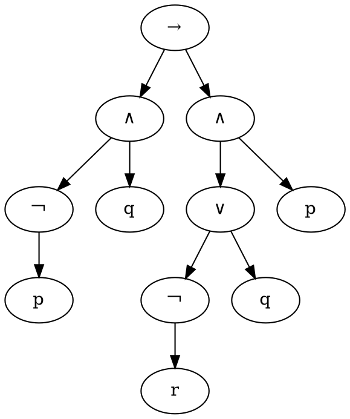

title: 根据逻辑算式生成语法树(二)
date: 2016-11-25 17:50:24
categories: 编程与算法
tags: ['数理逻辑',"语法树"]
---
本篇继承上篇，主要是把代码贴出来。

可视化的方式是将语法树按照`dot`格式写入`dot`文件，然后通过`graphviz`工具包转换为`png`。关于`graphviz`可以直接去官网下载。三个平台的版本都有。

<!--more-->
代码如下：
```cpp
#include <iostream>
#include <vector>
#include <cstdio>
#include <cstdlib>
#include <string>
#include <sstream>
#include <stack>
#include <fstream>
using namespace std;

const int num1 = 1;
const int num2 = 2;
const int num3 = 1;
const int num_atom = 3;
char op1[num1] = {'-'};     //低级运算符蕴含
char op2[num2] = {'|','&'}; //中级运算符析取合取
char op3[num3] = {'^'};     //高级运算符否定
char atoms[num_atom] = {'q','p','r'};   //原子

struct Node{
	int id;
	int child_num;
	string val;
	int left_child;
	int right_child;
};

vector<Node> nodes;
int now_id = 0; 

int my_stoi(string str){
	if(str == ""){
		return -1;
	}
	int ans = 0;
	int n = str.length();
	for(int i=0;i<n;i++){
		ans = ans*10 + (str[i]-'0');
	}
	return ans;
}

string my_itos(int num){
	stringstream stream;
	stream << num;
	return stream.str();
}
/*
*
* 将逻辑符号转换为已读的
*/
string formatValue(string value){
	if(value == "->"){
		value="→";
	}
	if(value == "&"){
		value="∧";
	}
	if(value == "|"){
		value="∨";
	}
	if(value == "^"){
		value="￢";
	}
	return value;
}
/*
*
* 生成一个节点，并将节点的id以字符串的形式返回
*/
string genNode(string value,string left,string right,int childnum){
//	cout<<"gen node "<<value<<endl;
	value = formatValue(value);
	Node node;
	node.child_num = childnum;
	node.val = value;
	node.left_child = my_stoi(left);
	node.right_child = my_stoi(right);
	node.id = now_id;
	nodes.push_back(node);
	now_id++;
	return my_itos(now_id-1);
}
bool isOP3orAtom(char c){
	for(int i=0;i<num3;i++){
		if(c == op3[i])
			return 1;
	}
	for(int i=0;i<num_atom;i++){
		if(c == atoms[i]){
			return 1;
		}
	}
	return 0;
}
/*
* 判断是否为否定运算符
*/
bool isOP3(char c){
	for(int i=0;i<num3;i++){
		if(c == op3[i])
			return 1;
	}
	return 0;
}
/*
* 判断是否为原子符号
*/
bool isAtom(char c){
	for(int i=0;i<num_atom;i++){
		if(c == atoms[i]){
			return 1;
		}
	}
	return 0;
}
/*
* 消去否定符，有否定符（op3）的话向下生成一个叶子节点，
* 没有否定符则生成当前生成一个叶子节点 
* 默认原子词符号（atoms） 
* 返回值，该节点id 
*/
string elimination_non(string formula){
	if(isOP3(formula[0])){
		string tmp = "";
		tmp = formula[0];
		return genNode(tmp,elimination_non(formula.substr(1,formula.length())),"",1);
	} else if(isAtom(formula[0])){
		return genNode(formula,"","",0);
	}else{
		return formula;
	}
}

/*
* 判断是否为析取或合取
*/
bool isOP2(char c){
	for(int i=0;i<num2;i++){
		if(c == op2[i])
			return 1;
	}
	return 0;
}
/*
* 消去逻辑运算符号，在无括号，无蕴含符号的子式中，
* 消去所有的析取、合取符号（op2中的符号），
* 并将符号两侧的子式送到下一个函数处理 
* 返回值，该子式的根节点id 
*/
string elimination_symbol(string formula){
	int n = formula.length();
	stack<string> s;
	int i=0;
	while(i < n){
		if(isOP2(formula[i])){
			string value = "";
			value += formula[i];
			string sub1 = "";
			while(!s.empty()){
				sub1 = s.top()+sub1;
				s.pop();
			}
			string sub2 = "";
			for(i=i+1;i<n;i++){
				if(isOP2(formula[i])){
					i--;
					break;
				}
				sub2 += formula[i];
			}
			string subid = genNode(value,elimination_non(sub1),elimination_non(sub2),2);
			s.push(subid);
		}else{
			string tmp = "";
			tmp += formula[i];
			s.push(tmp);
		}
		i++;
	}
	string new_formula = "";
	while(!s.empty()){
		new_formula = s.top()+new_formula;
		s.pop();
	}
	return elimination_non(new_formula);
}

bool isOP1(char c){
	for(int i=0;i<num1;i++){
		if(c == op1[i])
			return 1;
	}
	return 0;
}
/*
* 消去蕴含，在无括号的子公式中消去所有的蕴含符号（op1中的符号），
* 并将蕴含两侧的子式送到下一个函数中处理 
* 返回值，该子式的根节点id 
*/
string elimination_implication(string formula){
	int n = formula.length();
	stack<string> s;
	int i=0;
	while(i < n){
		if(isOP1(formula[i]) || (formula[i] == '-' && formula[i+1] == '>')){
			string sub1 = "";
			while(!s.empty()){
				sub1 = s.top()+sub1;
				s.pop();
			}
			string sub2 = "";
			for(i=i+1;i<n;i++){
				if(isOP1(formula[i]) || (formula[i] == '-' && formula[i+1] == '>')){
					i--;
					break;
				}
				if(formula[i] == '>'){
					continue;
				}
				sub2 += formula[i];
			}
			string subid = genNode("->",elimination_symbol(sub1),elimination_symbol(sub2),2);
			s.push(subid);
		}else{
			string tmp = "";
			tmp += formula[i];
			s.push(tmp);
		}
		i++;
	}
	string new_formula = "";
	while(!s.empty()){
		new_formula = s.top()+new_formula;
		s.pop();
	}
	return elimination_symbol(new_formula);
}

/*
* 消去括号，在原始式中消去所有的括号，
* 并将括号中的子式送到下个函数中处理
* 返回值，根节点的id 
*/
string elimination_brackets(string formula){
	int n = formula.length();
	stack<string> s;
	int i = 0;
	while(i < n){
		if(formula[i] == ')'){
			string subformula = "";
			while(1){
				string s_top = s.top();
				s.pop();
				if(s_top == "("){
					break;
				}else{
					subformula = s_top+subformula;
				}
			} 
			string subid = elimination_implication(subformula);
			s.push(subid);
		}else if(formula[i] != ' '){
			string tmp = "";
			tmp += formula[i];
			s.push(tmp);
		}
		i++;
	}
	string new_formula = "";
	while(!s.empty()){
		new_formula = s.top()+new_formula;
		s.pop();
	}
	return elimination_implication(new_formula);
}

/*
* 格式化原始式，将一些符号进行替换
*/
string formats(string str){
	string tmp = "";
	while(str.find("→") != -1){
		tmp = "→";
		str.replace(str.find("→"),tmp.length(),"->");
	}
	while(str.find("∧") != -1){
		str.replace(str.find("∧"),tmp.length(),"&");
	}
	while(str.find("∨") != -1){
		str.replace(str.find("∨"),tmp.length(),"|");
	}
	while(str.find("￢") != -1){
		str.replace(str.find("￢"),tmp.length(),"^");

	}	return str;
}
/*
* 将结果写入 dot 文件，并且通过dot 命令生成 png图片
*/
void writeToDot(){
	cout<<"write to dot"<<endl;
	ofstream fout("a.dot");
	fout<<"digraph G{"<<endl;
	for(int i=0;i<now_id;i++){
		Node node = nodes[i];
		cout<<node.id<<"\t"<<node.val<<"\t"<<node.left_child<<"\t"<<node.right_child<<endl;
		if(node.child_num == 2){
			fout<<node.id<<"[label=\""<<node.val<<"\"];"<<endl;
			fout<<node.id<<"->"<<node.left_child<<";"<<endl;
			fout<<node.id<<"->"<<node.right_child<<";"<<endl;
		}
		if(node.child_num == 1){
			fout<<node.id<<"[label=\""<<node.val<<"\"];"<<endl;
			fout<<node.id<<"->"<<node.left_child<<";"<<endl;
		}
		if(node.child_num == 0){
			fout<<node.id<<"[label=\""<<node.val<<"\"];"<<endl;
		} 
	}
	fout<<"}";
	fout.close();
	system("dot a.dot -Tpng -o image.png");
}

int main(int argc, char** argv) {
	string formula;
//	cin>>formula;
	formula = "(((^p)∧q) → (p∧(q∨(￢r))))";
	formula = formats(formula);
	cout<<formula<<endl;
	elimination_brackets(formula);
	writeToDot();
	for(int i=0;i<now_id;i++){
		Node node = nodes[i];
		cout<<node.id<<"\t"<<node.val<<"\t"<<node.left_child<<"\t"<<node.right_child<<endl;
	}
	return 0;
	
}
```
生成的`a.dot`代码如下：

生成的图像如下:
![pars_tree.png][1]
[1]: http://p1.bpimg.com/1949/286f7962492d4ea6.png